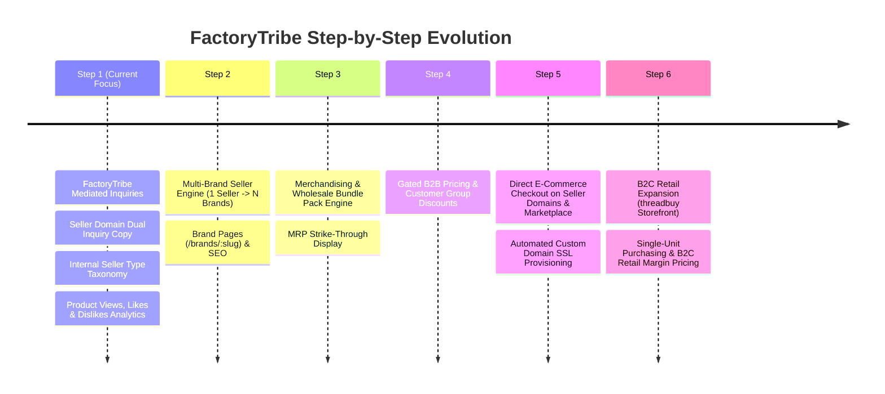

# FactoryTribe Master Architecture & Living Vision Document

> **NOTE FOR ALL AI AGENTS & DEVELOPERS**:  
> This is a living master document. **NEVER DELETE OR REMOVE** previously agreed features or vision details when modifying this file. Always append, adapt, and refine. Every phase builds progressively toward the ultimate end goal while keeping execution simple at each step.

---

## 1. Executive Summary & Core Platform Vision

**FactoryTribe (`factorytribe.com`)** is an all-in-one **Hybrid Multi-Vendor B2B Marketplace, Brand Engine & B2C Expansion Platform**, specifically built for wholesale fashion, brand-driven commerce, B2B deal mediation, and direct-to-consumer (B2C) retail expansion.

### Core Multi-Channel Concept
1. **Central B2B Marketplace Hub (`factorytribe.com`)**: Discovery, SEO, and deal-mediation portal managed by the **Platform Operator (Super Admin)**.
2. **Branded Vendor Storefronts (`sellerdomain.com` / `acmebrand.com`)**: Standalone, custom-branded storefronts hosted on custom domains with domain rental monetization.
3. **B2C Retail Expansion Storefront (`threadbuy`)**: Direct-to-consumer retail marketplace (`threadbuy.com`) where products are sold in **single units** with higher retail margins.

```
                                  ┌──────────────────────────────────────────────┐
                                  │           FactoryTribe Admin Panel           │
                                  │ (Global Catalog, Deal Mediation, Prospecting) │
                                  └──────────────────────┬───────────────────────┘
                                                         │
                                    ┌────────────────────┴────────────────────┐
                                    ▼                                         ▼
                        ┌───────────────────────┐                 ┌───────────────────────┐
                        │   Seller 1 (Vendor)   │                 │   Seller 2 (Vendor)   │
                        │ Internal Type: MFR    │                 │ Internal Type: DIST   │
                        └───────────┬───────────┘                 └───────────┬───────────┘
                                    │                                         │
                         ┌──────────┴──────────┐                              │
                         ▼                     ▼                              ▼
                 ┌──────────────┐      ┌──────────────┐                ┌──────────────┐
                 │   Brand A    │      │   Brand B    │                │   Brand C    │
                 │ acmebrand.com│      │ globex.com   │                │ zenith.com   │
                 └──────┬───────┘      └──────┬───────┘                └──────┬───────┘
                        │                     │                               │
                        └─────────────────────┼───────────────────────────────┘
                                              │
                                     Multi-Channel Publishing
                                              │
     ┌────────────────────────────────────────┼────────────────────────────────────────┐
     ▼                                        ▼                                        ▼
┌──────────────────────────────────────┐ ┌──────────────────────────────────────┐ ┌──────────────────────────────────────┐
│ 🌐 sellerdomain.com (Seller/Brand)   │ │ 🌐 factorytribe.com (Central B2B Hub)│ │ 🌐 threadbuy (B2C Retail Marketplace)│
│ • Direct Sales / Direct Inquiries    │ │ • Brand Discovery & SEO Landing      │ │ • B2C Single-Item Purchase (Qty = 1) │
│ • Dual Inquiry Copy sent to Admin    │ │ • Operator Mediated Wholesale Deals  │ │ • Higher Retail Margins / Prices     │
│ • Domain Rental Monetization         │ │ • Internal Seller Taxonomy (Hidden)  │ │ • Direct Consumer Checkout           │
│ • Gated Pricing & Wholesale Packs    │ │ • Gated Pricing & Wholesale Packs    │ │ • Shared Inventory & Payout Engine   │
│ • Engagement: Views, Likes, Dislikes │ │ • Engagement: Views, Likes, Dislikes │ │ • Engagement: Views, Likes, Dislikes │
└──────────────────────────────────────┘ └──────────────────────────────────────┘ └──────────────────────────────────────┘
```

---

## 2. Complete Capability Specification (End-State Vision)

### A. Dual-Listing & Domain Routing
* **Marketplace Listing (`factorytribe.com`)**: All products published across the platform are aggregated on the central hub.
* **Storefront Autonomy (`sellerdomain.com`)**: Every product is simultaneously available on the vendor's custom domain storefront.
* **Monetization**: Platform operator charges a fixed rental fee (or free tier) for hosting and managing vendor custom domains.
* **Dual Inquiry Routing**: When a buyer submits an inquiry on a seller's domain, the inquiry is delivered to the **Seller** AND a duplicate copy is automatically captured in the **FactoryTribe Admin Panel** for prospect tracking and deal intelligence.

### B. Multi-Brand Engine ($1 \text{ Seller} \rightarrow N \text{ Brands}$)
* **Entity Relationship**: A single `Seller` (e.g., an agency, factory conglomerate, or distributor) can create and manage $N$ distinct `Brands`.
* **Brand Profile**: Each `Brand` owns its `name`, `slug`, `logo`, `banner`, `story`, `lookbook_media`, `custom_domain`, and `seo_keywords`.
* **Routing**:
  * `/brands/:brand_slug` (or `acmebrand.com`) $\rightarrow$ Brand-specific storefront.
  * `/vendors/:seller_handle` $\rightarrow$ Vendor profile showing all managed brands and items.

### C. Seller Business Type Taxonomy
* **Seller Type Enum**: `MANUFACTURER`, `DISTRIBUTOR`, `WHOLESALER`.
* **Phase 1 Behavior**: Kept strictly **internal** in Admin for lead tracking, prospect routing, and operator intelligence (hidden from public buyers on storefronts).
* **Future Behavior**: Exposed as an optional buyer search filter on `factorytribe.com`.

### D. Gated B2B Access & Dynamic Customer Discounts
* **Guest / Unregistered Visitors**:
  * Publicly indexable brand profile, story, lookbooks, and catalog previews.
  * Wholesale prices and MOQ deal terms are hidden ("*Register to View Wholesale Prices*").
* **Logged-In Wholesale Buyers**: Full access to B2B wholesale prices, strike-through MRP savings, volume tiers, and checkout.
* **Dynamic Discounts**: Integrates Medusa v2 `CustomerGroup` $\rightarrow$ `PriceList` to grant personalized discount tiers (e.g. *Boutique Retailer*, *VIP Buyer*, *Volume Distributor*).

### E. Merchandising, MRP & Wholesale Bundle Pack Engine
* **MRP / MSRP Attribute**: Strike-through savings display (`~~MRP $120~~` $\rightarrow$ `$89`).
* **Bundle Pack Quantities**: Wholesale items are sold in fixed bundle sizes (e.g., 6 pcs, 12 pcs).
* **Increment Logic & Formula**:
  * Storefront quantity selector increments strictly by `bundle_size` ($0 \rightarrow 6 \rightarrow 12 \rightarrow 18$).
  * $\text{Quantity} = N \times \text{bundle\_size}$
  * $\text{Pack Price} = \text{unit\_listed\_price} \times \text{bundle\_size}$
  * $\text{Cart Line Total} = \text{Quantity} \times \text{unit\_listed\_price}$
  * API Validation: `quantity % bundle_size === 0`.

### F. Product Engagement Analytics (Views, Likes & Dislikes)
* **Product Views (`views_count`)**: Increments on product page load (`POST /store/products/:id/view`).
* **Product Reactions (`likes_count`, `dislikes_count`)**: Interactive upvote/downvote buttons on storefronts (`POST /store/products/:id/react`).
* **Admin Intelligence**: Aggregated demand signal reporting in Admin to spot trending items and prioritize deal follow-ups.

### G. B2C Retail Expansion Storefront (`threadbuy`)
* **Single Unit Purchases**: On `threadbuy`, the wholesale bundle pack restriction is removed (`bundle_size = 1`), allowing retail consumers to purchase individual pieces.
* **Retail Pricing & Higher Margins**: Price sets attach higher retail margins for B2C sales while maintaining B2B bulk discount tiers on `factorytribe.com`.
* **Multi-Channel Medusa Sales Channels**: Uses Medusa v2 Sales Channels (`B2B Sales Channel` vs `B2C ThreadBuy Sales Channel`) to handle catalog publishing and price list selection cleanly.

---

## 3. Phased Step-by-Step Implementation Roadmap



---

## 4. Technical Architecture Details ([`packages/core`](file:///d:/mercur-new/packages/core))

### A. Core Data Models
1. **`Seller` Extensions**:
   * `seller_type`: `MANUFACTURER` | `DISTRIBUTOR` | `WHOLESALER` (Internal).
   * `custom_domain`, `rental_fee_status`.
2. **`Brand` Module (`packages/core/src/modules/brand`)**:
   * Linked via `brand-seller-link.ts` ($1 \text{ Seller} \rightarrow N \text{ Brands}$) and `brand-product-link.ts`.
3. **`Inquiry` Module (`packages/core/src/modules/inquiry`)**:
   * Captures `source_domain`, `seller_id`, `buyer_email`, `message`, `is_operator_copy`.
4. **Product Engagement Fields**:
   * `views_count`, `likes_count`, `dislikes_count`.
5. **B2C Sales Channel & Price Lists**:
   * `b2c_sales_channel_id` mapped to `threadbuy` storefront application (`apps/storefront`).

---

## 5. Cumulative Vision Change Log

* **2026-08-10**: Initial architecture vision created for multi-tenancy vs domain-separated storefronts.
* **2026-08-11 (Morning)**: Added Brand-centric SEO landing pages, Operator Lead Mediation, Gated B2B Pricing, and Wholesale Bundle Pack Engine.
* **2026-08-11 (Midday)**: Added Multi-Brand Seller Engine ($1 \text{ Seller} \rightarrow N \text{ Brands}$) and Seller Type Taxonomy (`MANUFACTURER`, `DISTRIBUTOR`, `WHOLESALER`).
* **2026-08-11 (Afternoon)**: Established Step 1 Simplicity Focus — `factorytribe.com` mediated inquiries, seller domain dual inquiry tracking, internal seller type scoping, and Product Views/Likes/Dislikes analytics.
* **2026-08-11 (Latest)**: Appended B2C Retail Expansion Storefront **`threadbuy`** (`threadbuy.com`) for single-unit purchases ($bundle\_size = 1$) with higher retail margin pricing.

---

## 6. Master Rules & Guardrails for AI Agents

> [!IMPORTANT]
> **NEVER DELETE DISCUSSED FEATURES FROM THIS VISION FILE.**  
> Always append and adapt. Even if an immediate implementation step is simple, keep the full end-state vision intact so future sessions build seamlessly toward the final goal.

> [!TIP]
> **Keep Step 1 simple while preserving data hooks for Step 2+.**  
> In Step 1, focus on Inquiry flow, dual inquiry tracking, internal seller types, and engagement analytics, but structure database tables so Brands, Bundle Packs, Customer Groups, and B2C Channels connect cleanly when activated.
